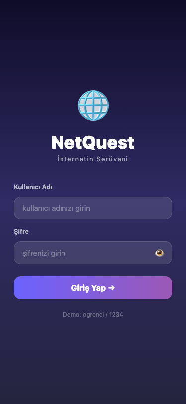
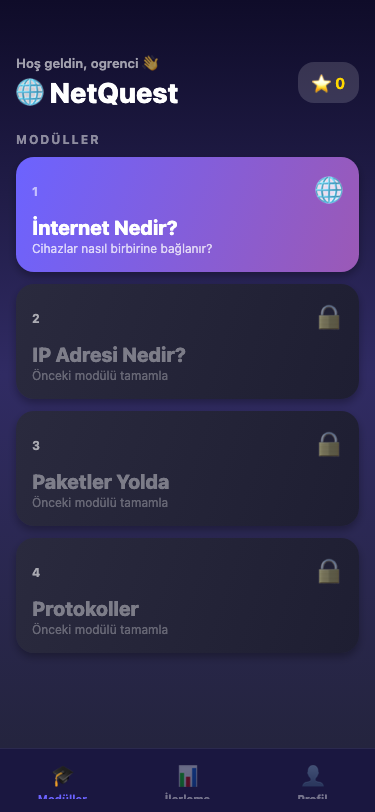
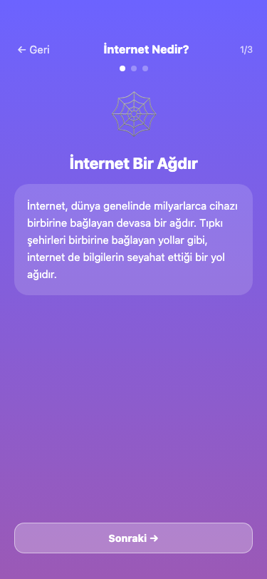
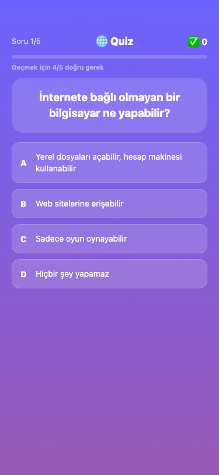
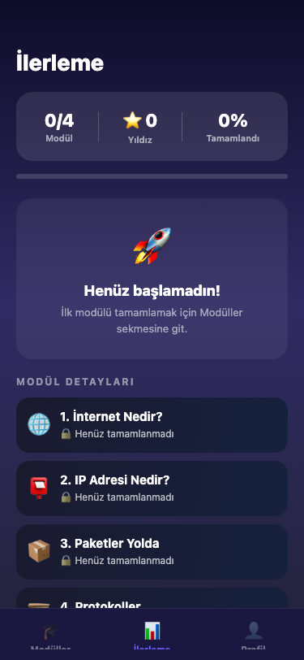
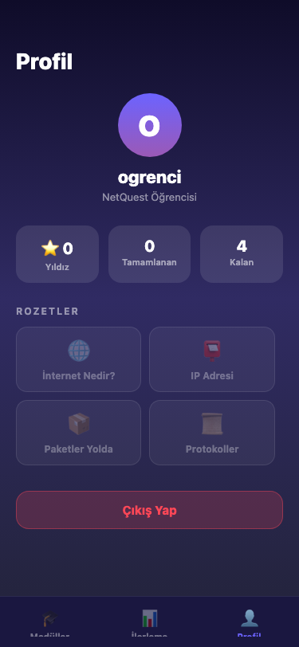

# 🌐 NetQuest — İnternetin Serüveni

Ortaokul öğrencileri (11-14 yaş) için geliştirilmiş, **internetin nasıl çalıştığını** öğreten pedagojik bir mobil eğitim uygulaması.

> Yıldız Teknik Üniversitesi — İşletim Sistemleri ve Bilgisayar Ağları Dersi Proje Ödevi

---

## 📸 Ekran Görüntüleri

<p align="center">
  
  
  
  
  
  
</p>

---

## 📱 Uygulama Hakkında

NetQuest, öğrencilerin internet teknolojilerini eğlenceli ve interaktif bir şekilde öğrenmesini sağlar. Her modül önce konuyu animasyonlu slaytlarla anlatır, ardından quiz ile pekiştirir.

### Modüller

| # | Modül | Konu |
|---|---|---|
| 1 | 🌐 İnternet Nedir? | Ağ yapısı, sunucu-istemci modeli |
| 2 | 📮 IP Adresi Nedir? | IPv4, özel/genel IP |
| 3 | 📦 Paketler Yolda | Veri paketleri, router |
| 4 | 📜 Protokoller | HTTP/HTTPS, DNS |

---

## ✨ Özellikler

### Temel
- Kullanıcı girişi (kullanıcı adı + şifre) — şifre göster/gizle butonu
- Her modülde slayt bazlı konu anlatımı
- Çoktan seçmeli quiz (yanlış cevapta açıklama gösterimi)
- Yıldız bazlı puanlama sistemi (modül başına 0-3 yıldız)

### Navigasyon
- **Alt tab bar** — Modüller, İlerleme, Profil sekmeleri
- Modül/Quiz/Sonuç ekranlarında tab bar otomatik gizlenir
- Nested stack + tab navigator mimarisi

### Quiz Sistemi
- **Soru havuzu**: Her modülde 7 soru — her denemede 5 tanesi rastgele seçilir
- **%70 geçme eşiği** — 5 sorudan en az 4'ü doğru
- Her denemede sorular ve seçenekler yeniden karıştırılır
- Geçince konfeti animasyonu 🎉

### Modül Kilitleme
- Önceki modül tamamlanmadan sonraki modül kilitli
- Kilidi açılmış modüller vurgulanır

### İlerleme Ekranı
- Özet kart: tamamlanan modül sayısı, toplam yıldız, tamamlanma yüzdesi
- Genel ilerleme çubuğu
- Modül bazlı detay listesi
- Henüz başlanmamışsa boş durum mesajı

### Profil Ekranı
- Avatar (kullanıcı adının baş harfi)
- İstatistikler: toplam yıldız, tamamlanan modül, kalan modül
- Rozet sistemi (tamamlanan modüller için)
- Çıkış yap butonu

### Landscape Desteği
- Tüm ekranlar yatay yönde de düzgün çalışır
- HomeScreen: 2 kolonlu ızgara
- LoginScreen: logo sol / form sağ düzeni
- ModuleScreen: 2 kolonlu içerik düzeni

---

## 🛠️ Teknolojiler

- [React Native](https://reactnative.dev/) + [Expo](https://expo.dev/) (SDK 54, Managed Workflow)
- TypeScript
- [Zustand](https://zustand-demo.pmnd.rs/) — state yönetimi
- [React Navigation](https://reactnavigation.org/) — stack + bottom tab navigator
- [Expo Linear Gradient](https://docs.expo.dev/versions/latest/sdk/linear-gradient/) — gradyan arka planlar
- [react-native-confetti-cannon](https://github.com/VincentMcLoughlin/react-native-confetti-cannon) — konfeti animasyonu

---

## 🚀 Kurulum ve Çalıştırma

### Gereksinimler

- Node.js 18+
- [Expo Go](https://expo.dev/go) uygulaması (iOS veya Android)

### Adımlar

```bash
# Repoyu klonla
git clone https://github.com/baristekinn0/netquest-internetin-seruveni.git
cd netquest-internetin-seruveni

# Bağımlılıkları kur
npm install

# Uygulamayı başlat
npx expo start
```

Terminalde çıkan QR kodu **Expo Go** ile tara — uygulama telefonunda açılır.

> Mac ve telefon aynı Wi-Fi ağında olmalıdır.

### Demo Giriş Bilgileri

```
Kullanıcı Adı : ogrenci
Şifre         : 1234
```

---

## 📁 Proje Yapısı

```
src/
├── data/
│   └── modules.ts          # Modül içerikleri ve 7 soruluk quiz havuzları
├── navigation/
│   └── AppNavigator.tsx    # Root Stack + Bottom Tab + Modules Stack
├── screens/
│   ├── LoginScreen.tsx     # Giriş ekranı (landscape destekli)
│   ├── HomeScreen.tsx      # Modül listesi + kilit sistemi (landscape grid)
│   ├── ModuleScreen.tsx    # Slayt bazlı konu anlatımı (landscape destekli)
│   ├── QuizScreen.tsx      # Quiz (soru havuzu, %70 eşik, karıştırma)
│   ├── ResultScreen.tsx    # Sonuç + konfeti animasyonu
│   ├── ProgressScreen.tsx  # İlerleme özeti ve modül detayları
│   └── ProfileScreen.tsx   # Kullanıcı profili, rozetler, çıkış
├── store/
│   └── useStore.ts         # Zustand global state
└── types/
    └── index.ts            # TypeScript tipleri
```

---

## 🎮 Ekran Akışı

```
Login
  └── Main (Bottom Tabs)
        ├── Modüller
        │     ├── Home (modül listesi)
        │     ├── Module (slaytlar)
        │     ├── Quiz
        │     └── Result
        ├── İlerleme
        └── Profil
```

---

## 👥 Geliştirici

- Barış Tekin
- Alperen Baştuğ 22091010 (GitHub: alperennbstg)
- Sadık Ahmet Fırat
- Muammer Atçeken 21091031 (GitHub: Bladeszz)
- Berkay Pamuk 21091011 (GitHub: BerkayPamuk)
